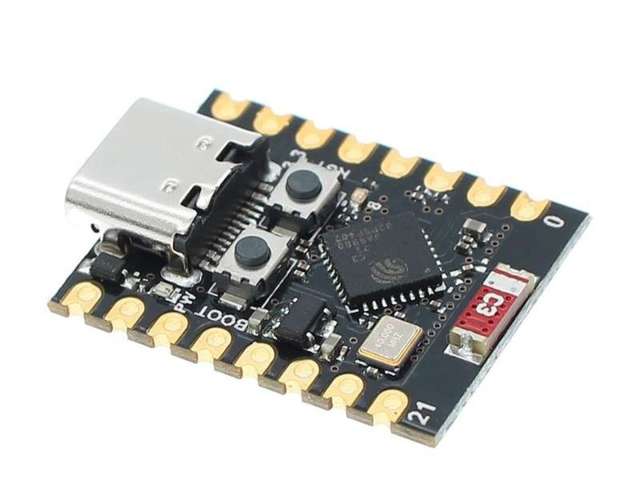
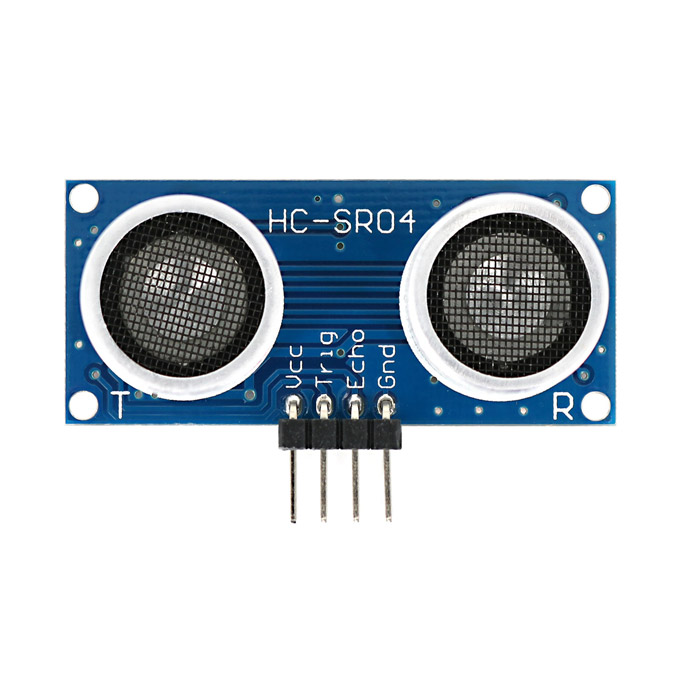
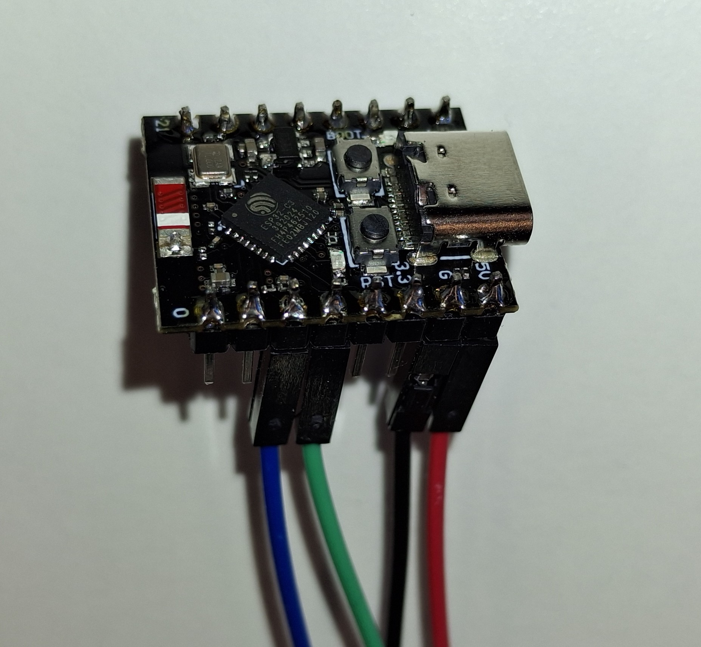
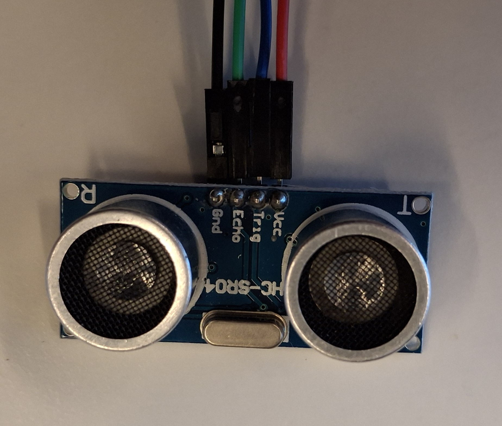
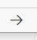

# Topics op een extern Embedded Device

Je kunt externe apparaten zoals microcontrollers gebruiken om data te publiceren op ROS2 topics, services aan te bieden of acties uit te voeren. In deze opdrachten gaan we aan de slag met een ultrasoon sensor die is gekoppeld aan een ESP32 microcontroller. We zullen de data van de ultrasoon sensor publiceren op een ROS2 topic, zodat we deze kunnen gebruiken in onze ROS2 toepassingen.  

 Met een ultrasoon sensor kun je afstanden meten. In voorgaande opdrachten hebben we deze sensor gesimuleerd. Om een sensor te kunnen gebruiken in ROS2, moet deze eerst worden gekoppeld aan een microcontroller. In dit geval gebruiken we een ESP32 device. Dit device zal vervolgens de data van de ultrasoon sensor publiceren op een ROS2 topic. In deze opdrachten gebruiken we een SR04 ultrasoon sensor, maar er zijn ook andere types beschikbaar die vergelijkbare functionaliteit bieden.

Om de koppeling tussen het ESP32 device en *ROS2 Jazzy* tot stand te brengen, maken we gebruik van microROS. microROS is een implementatie van ROS2 die speciaal is ontworpen voor microcontrollers. Hiermee kunnen we ROS2-functionaliteit integreren in kleine embedded systemen zoals de ESP32.

## Opdracht 1: Installeren en configureren van microROS-agent
Voordat we de ESP32 kunnen programmeren, moeten we ervoor zorgen dat de microROS-agent correct is geïnstalleerd en geconfigureerd op je computer. De microROS-agent fungeert als een brug tussen de microcontroller en het ROS2-ecosysteem, waardoor de data van de ultrasoon sensor kan worden gepubliceerd op een ROS2 topic.

De microROS-agent kan worden geïnstalleerd en geconfigureerd met de volgende stappen:
```bash
mkdir -p ~/microROS_agent_ws/src
cd ~/microROS_agent_ws/src
sudo apt update
sudo apt install -y ros-jazzy-micro-ros*

# Verkrijg de juiste ROS2 distributie
git clone -b jazzy https://github.com/micro-ROS/micro-ROS-Agent.git

cd ..
# Build de microROS agent
colcon build --symlink-install
source install/setup.bash
echo "source ~/microROS_agent_ws/install/setup.bash" >> ~/.bashrc
```
:::{note}
Alternatief als micro ros-agent niet werkt:
```bash
cd ~
rm -fr ~/microROS_agent_ws
sudo apt remove ros-jazzy-micro-ros*
```

verwijder de regel "source ~/microROS_agent_ws/install/setup.bash" uit ~/.bashrc(een van de laatste regels) met:
```
gedit ~/.bashrc
```


 installeer micro-ros-agent opnieuw met volgend script:
 [install_microros_agent](https://github.com/GerardHarkema/railtrack/blob/jazzy/scripts/install_microros_agent.sh)  

:::


## Opdracht 2: Aansluiten van de ultrasoon sensor op de ESP32
In deze opdracht gebruiken we een ESP32C3 (Super-mini) device, maar je kunt ook een ander ESP32 device gebruiken. Zorg er wel voor dat je de juiste pin-aansluitingen gebruikt in je code.
 


De SR04 ultrasoon sensor heeft vier pinnen: VCC, GND, Trig en Echo. Deze moeten correct worden aangesloten op de ESP32 om de sensor te kunnen gebruiken.



Pin aansluitingen:

|   ESP32-C3 Pin   | SRF-04 Pin |
|:----------------:|:----------:|
|        5V        |    VCC     |
|       GND        |    GND     |
|        2         | Trig       |
|        3         | Echo       |

Voorbeeld van de aansluitingen, let op de kleuren!:
::::{grid} 2
:::{grid-item-card} 

:::
:::{grid-item-card}

:::
::::

## Opdracht 3: ESP32 verbinden met de computer
Om de ESP32 te kunnen programmeren, moet deze worden verbonden met je computer via een USB-kabel. Zorg ervoor dat de juiste drivers zijn geïnstalleerd, zodat je computer de ESP32 kan herkennen. Zodra de verbinding is gemaakt, kun je de ESP32 programmeren met behulp van Visual Studio Code en PlatformIO.

:::{note}
Als je gebruik maakt van een virtuele machine, zorg er dan voor dat de USB-poort correct is doorgegeven aan de virtuele machine. Als je de USB inplugt, zou je een melding moeten zien in de terminal van de virtuele machine dat er een nieuw apparaat is aangesloten. Als dit niet het geval is, controleer dan de instellingen van je virtuele machine om ervoor te zorgen dat de USB-poort correct is geconfigureerd.
:::

## Opdracht 4: Programmeren van de ESP32 met microROS
Het ESP32 device moet worden geprogrammeerd om de ultrasoon sensor aan te sturen en de gemeten data te publiceren op een ROS2 topic. Hiervoor gebruiken we Visual Studio Code met PlatformIO, wat een handige omgeving biedt voor het ontwikkelen van embedded software. In deze stap zullen we de code schrijven die de ultrasoon sensor aanstuurt, de afstand meet en deze informatie publiceert op het ROS2 topic **/sensor_info**.

### Installeren van PlatformIO in Visual Studio Code
Als je PlatformIO nog niet hebt geïnstalleerd, kun je dit doen via de extensies in Visual Studio Code. Zoek naar "PlatformIO" en installeer de extensie. Na installatie kun je onderstaand PlatformIO project openen.

### Installeren 99-platformio.rules
Om de ESP32 te kunnen programmeren zonder root-toegang, moet je de juiste udev-regels instellen. Dit doe je door het bestand *99-platformio.rules* te kopiëren naar de juiste locatie en de regels toe te voegen. Voer de volgende commando's uit in je terminal:

```bash 
curl -fsSL https://raw.githubusercontent.com/platformio/platformio-core/develop/platformio/assets/system/99-platformio-udev.rules | sudo tee /etc/udev/rules.d/99-platformio-udev.rules
```
:::{note}
Dit commando geeft veel oupout, maar dat is normaal. Het kopieert de udev-regels naar de juiste locatie.
Na het toevoegen van de udev-regels, moet je het USB-apparaat opnieuw aansluiten.
:::

### Openen van het microROS project
Open met Visual Studio Code het project van de range-sensor in de volgende map (alleen map selecteren):
```text
~/ros2_industrial_ws/src/ROS2_industrial/1_basics/ESP32/ultrasonic_sensor
```
:::{note}
Als je de map opent zal het een tijdje duren voordat alle dependencies zijn geïnstalleerd. Wacht hier geduldig op. Je kunt het proces hiervan volgen in de linkeronderhoek van Visual Code.
:::

Bekijk de code in het bestand *src/main.cpp*. Hierin staat de code die de ultrasoon sensor aanstuurt en de data publiceert op het ROS2 topic. Je zult zien dat er gebruik wordt gemaakt van microROS functies om de communicatie met ROS2 mogelijk te maken.

### Compileren en uploaden van de code naar de ESP32
Nadat je de code hebt bekeken, kun je deze compileren en uploaden naar de ESP32. Dit doe je door in Visual Code op het PlatformIO icoon te klikken en vervolgens de optie "Upload" te selecteren. 




:::{tip}
Zorg ervoor dat je de juiste board en poort hebt geselecteerd in het *platformio.ini* bestand voordat je uploadt. Er is al vooringesteld dat je een ESP32C3 (Super-mini) gebruikt, maar als je een ander ESP32 device hebt, moet je dit aanpassen in het *platformio.ini* bestand.
:::

## Opdracht 5: Starten van de microROS-agent
Voordat we de ESP32 kunnen testen, moeten we de microROS-agent starten op je computer. Dit is essentieel omdat de agent de communicatie tussen de ESP32 en ROS2 mogelijk maakt. Je kunt de microROS-agent starten met het volgende commando in je terminal:


```bash
ros2 run micro_ros_agent micro_ros_agent serial --dev /dev/ttyACM0
```

:::{note}
Als je een andere USB-poort gebruikt, zorg er dan voor dat je het juiste apparaat opgeeft in het commando. Je kunt de beschikbare USB-seriële apparaten controleren met het commando `ls /dev/ttyUSB* /dev/ttyACM* 2>/dev/null` en let daarbij op namen zoals `/dev/ttyUSB0` of `/dev/ttyACM0` voordat je de microROS-agent start.
:::

Controleer of de microROS-agent correct is gestart door te kijken naar de output in de terminal. Je zou een bericht moeten zien dat aangeeft dat de agent klaar is om verbindingen te accepteren. Als er fouten optreden, controleer dan of je de juiste USB-poort hebt opgegeven en of de ESP32 correct is aangesloten.

:::{warning}
Let op als er geen verbinding tot stand komt, vraag dan de docent om hulp. Er is een bekende fout die alleen door de docent kan worden opgelost.
:::

## Opdracht 6: Testen van de ultrasoon sensor
Nadat het device is geprogrammeerd kun je de werking controlleren met (in nieuwe terminal):

```bash
ros2 topic echo /sensor_info
```
Als het goed is zul je nu de data van de ultrasoon sensor zien verschijnen in de terminal. Dit betekent dat de ESP32 correct is geprogrammeerd en dat de microROS-agent succesvol communiceert met het ROS2-ecosysteem. Je kunt nu een afstand meten met de ultrasoon sensor en deze informatie gebruiken in je ROS2 toepassingen. Probeer bijvoorbeeld je hand voor de sensor te houden en kijk hoe de gemeten afstand verandert in de terminal.


## Opdracht 7: Testen van de ultrasoon sensor node met andere ROS2 node's

Je kunt nu andere nodes starten zoals we dat in het hoofdstuk [`ROS2 Topics`](../topics.md) hebben gedaan. Je kunt bijvoorbeeld de node van `assignmet1` starten en kijken hoe de data van de ultrasoon sensor wordt gebruikt in die node. Probeer ook andere nodes te starten en te zien hoe ze reageren op de data van de ultrasoon sensor. Dit is een goede manier om te begrijpen hoe verschillende ROS2 nodes samenwerken en hoe sensordata kan worden gebruikt in een ROS2 omgeving.

:::{tip}
je kunt het project van de range-sensor ook als template gebruiken voor andere sensoren. Als je bijvoorbeeld een andere sensor hebt die data kan publiceren, kun je de code van de range-sensor aanpassen om deze nieuwe sensor aan te sturen en de data te publiceren op een ROS2 topic. Dit is een handige manier om snel nieuwe sensoren toe te voegen aan je ROS2 projecten.
:::