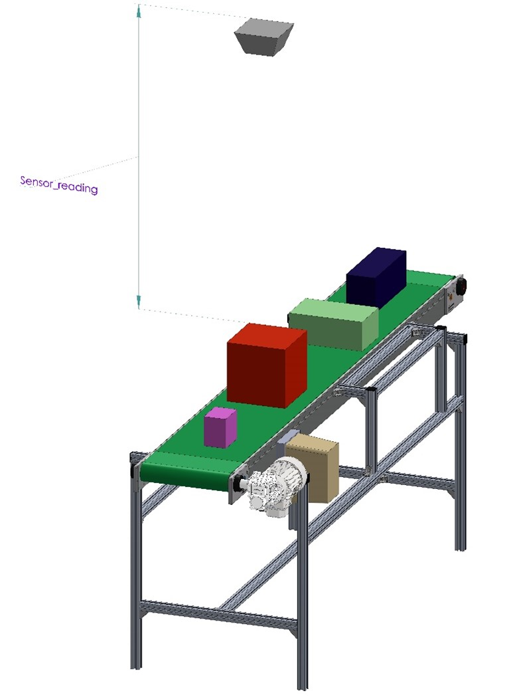

# ROS Topics: Publishers and Subscribers

In deze workshop leer je de basis van ROS2 topics. De theorie hiervan wordt gedoceerd, maar kun je ook vinden op deze [website van ROS](https://docs.ros.org/en/jazzy/Tutorials/Beginner-CLI-Tools/Understanding-ROS2-Topics/Understanding-ROS2-Topics.html)


We gaan in deze en volgende workshops aan de slag met een hoogte meting van dozen op een conveyor(transportband), zie afbeelding hieronder. 




In de workshop wordt de meetwaarde van de range-sensor gepresenteerd door het topic **/sensor_info**. Er zijn twee methodes om deze sensorwaardes te genereren:


:::::{card} 
::::{tab-set}

:::{tab-item} Simulatie
Start de node die de range-sensor simuleert.

```bash
ros2 run range_sensor sensor_info_publisher_simulation 
```
{octicon}`alert;2em;sd-text-info` In de terminal zal slechts 1 regel output worden gegenereerd

:::

:::{tab-item} Realworld
De sensor waardes worden gegenereert met een ultrasoonsensor die aangesloten is op een ESP32-board(Embedded System). Dit staat beschreven in: [ESP32 ultatrasonic-sensor](./ESP32/ultrasonic_sensor.md)

:::

::::

:::::


Controleer of de range-sensor node ook daadwerkelijk gestart is(doe dit in een nieuwe terminal)
```bash
ros2 node list
```
Bekijk welke topics(onderwerpen) door de node gepubliceerd worden
```bash
ros2 topic list
```
Volg de messages(berichten) die op het topic worden gepubliceerd

```bash
ros2 topic echo /sensor_info
```
Je kunt deze monitor stoppen door ctrl+c

Informatie opvragen over het gebruik van de topic

```bash
ros2 topic info /sensor_info
```
Je vindt hierin de volgende informatie
* Bericht type, ook wel "interface" genoemd in ROS2 (waarbij "interface" verwijst naar berichten, services en acties), of message-type genoemd
* Aantal nodes dat publiceren op dit topic
* Aantal nodes dat lezen van dit topic

In ROS2 verwijst "interface" naar berichten (messages), services en acties; met het onderstaande commando vraag je specifiek de definitie van het bericht (message type) op.
```bash
ros2 interface show range_sensors_interfaces/msg/SensorInformation
```

## Opdracht 1
In deze opdracht ga je een subscriber maken in een Python programma op het topic **/sensor_info**

Je gaat daartoe het Python programma **assignment1.py** bewerken op bepaalde aangeven plaatsen.


Je kunt de broncode van het programma openen met de editor uit je development omgeving(bijvoorbeeld Visual Code), door naar de juiste map/directory te navigeren.
Het bestand bevindt zich op de volgende locatie:
**~/ros2_industrial_ws/src/ROS2_industrial/1_basics/range_sensor/range_sensor/**


Als alternatief kunt het bestand ook op de volgende wijze openen:
```bash
gedit ~/ros2_industrial_ws/src/ROS2_industrial/1_basics/range_sensor/range_sensor/assignment1.py
```


Opmerking: als gedit nog niet is geinstalleerd dan kun je dat als volgt doen:
```bash
sudo apt install gedit
```
## Opdracht 1.1 creëer een Python subscriber
Maak een subscriber aan met de volgende gegevens:
* Topic: /sensor_info
* Message-type: SensorInformation
* Callback: sensor_info_callback

Noem de subscriber 'sensor_info_subscription' en wijs deze toe aan `self.sensor_info_subscription` binnen de constructor of een methode van de klasse, zodat de subscriber in de context van het object wordt aangemaakt.
Voer de code in onder onderstaande regel in het assignment1.py bestand, binnen de constructor (`__init__` methode) van de klasse:

```
#<Assignment 1.1, creëer hier de subscriber op het topic /sensor_info>*
```

Test de werking van het programma
```
ros2 run range_sensor assignment1 
```

## Opdracht 1.2 Bereken de hoogte van de doos en druk deze af
In deze opdracht ga je de hoogte van het object op de conveyor berekenen. De sensor is op 2 meter hoogt t.o.v. de conveyor gemonteerd.
Maak een berekening voor de hoogte van het object onder de sensor door schuift. Druk deze hoogte af met het *"self.get_logger().info()"* statement in de *"sensor_info_callback()"* member-functie.

Voer de code in onder onderstaande regel in het assignment1.py bestand

```
#<Assignment 1.2, bereken hier de hoogte van het object>*
```

Let op: Volgens het gegevensblad van de sensor meet de sensor tot 2.0 meter, echter metingen groter dan 1.9 meter zijn zeer onderhevig aan ruis en kunnen z.g.n. false-positive metingen opleveren. Houd hiermee rekening in je berekening.

Test de werking van het programma
```
ros2 run range_sensor assignment1 
```

## Opdracht 1.3 Creeër een nieuw message type
In deze opdracht ga je een nieuw message type maken waarin later, via een topic, de hoogte van het object onder de sensor wordt gepubliceerd. 
Naam message type: BoxHeightInformation
Infomatie in message type: box_height (type float32)

Volg daar toe de volgende handelingen
* Navigeer naar de directory *msgs*  in de package 
*range_sensors_interfaces*
* Maak een nieuw bestand *BoxHeightInformation.msg*
* Open het bestand en voeg de volgende regel toe: 
    * float32 box_height   # Height of box
* Sla het bestand op

Om dit nieuwe type in de *Colcon build* op te nemen dien je het *CMakeLists.txt* bestand kenbaar te maken dat er een message type wordt toegevoegd.
* Navigeer naar de **root**-directory van de package package 
*range_sensors_interfaces*
* Open het bestand *CMakeLists.txt* (dit is *bestaand* bestand)
* Zoek de regel met *rosidl_generate_interfaces(${PROJECT_NAME}* op.
* Plaats onder de regel de volgende regel:
    * "msg/BoxHeightInformation.msg"
* Sla het bestand op

Vervolgens dient je workspace gebouwd te worden:
* Navigeer naar de **root**-directory van je workspace
```bash
cd ~/ros2_industrial_ws/
```
* Bouw het de workspace:
```bash
colcon build --symlink-install
```
--> Beter nog bouw alleen de package die je hebt gewijzigd
```bash
colcon build --symlink-install --packages-select range_sensors_interfaces
```
* Activeer je nieuw geboude environment
```bash
source install/setup.bash
```
--> Of
```bash
source ~/ros2_industrial_ws/install/setup.bash 
```

Let op: Dit laatste dien je te doen in alle geopende terminals

Controleren van je gemaakte message
* Gebruik onderstaand commando om een lijst met alle messages, services en actions op te vragen
```bash
ros2 interface list
```
Je kunt ook een filter maken door midel van een gepijpt grep commando waar in een deel van de message naam is opgenomen (in dit geval **Box**)
```bash
ros2 interface list | grep Box
```
Bekijk of je message goed is gefineerd
```bash
ros2 interface show range_sensors_interfaces/msg/BoxHeightInformation
```

## Opdracht 1.4 Creeër een Python publisher
Maak op een publisher aan met de volgende gegevens:
* Topic: /box_height_info
* Message-type: BoxHeightInformation
* Queue-size: 10

Noem de publisher 'box_height_publisher', zorg ervoor dat dit in de context van de klasse gebeurt, door de *self* operator.
Voer de code in onder onderstaande regel in het assignment1.py bestand
```
#<Assignment 1.4, Creëer hier de publisher voor het publiceren van de box hoogte>
```
Om er voor te zorgen dat het message-type beschikbaar is in je programma dien je de juist library te importeren.

Voer de code in onder onderstaande regel in het assignment1.py bestand:

```
#< Assignment 1.4, importeer hier de message type die je hebt aangemaakt voor de box hoogte>  
```

Je hebt nu een publisher gemaakt, waarop je de box hoogte kunt publiceren. Voeg daartoe code toe op de plaats waar je de box hoogte hebt berekend.
Maak daarvoor eerst het volgende object aan in de functie de die box hoogte berekend
```python
box_height_info = BoxHeightInformation()
```
Vul daarna het object in met de box hoogte
```python
box_height_info.box_height = <<door jou berekende box hoogte>>
```
Als laatste kun je de de box hoogte publiseren
```python
self.box_height_publisher.publish(box_height_info)
```
Test het programma door in 3 terminals de volgende nodes te starten
```bash
ros2 run range_sensor sensor_info_publisher_simulation 
```
```bash
ros2 run range_sensor <node van opdracht 1>
```
```bash
ros2 topic echo <topic waarin de box hoogte is gepubliceert>
```

Test de werking van de opdracht en voer eventueel verbeteringen door in de opdracht code.

## Opdracht 1.5 Gebruik rgt-graph
Je kunt een grafisch overzich maken van alle nodes en hun bijbehorende topics met het volgende commando. Zorg er wel voor dat je de nodes uit opdracht 1.4. hebt gestart.
```bash
ros2 run rqt_graph rqt_graph 
```
Maak een evaluatie van wat door *rqt_graph* wordt gepresenteerd. Je kunt deze tool gebruiken om inzcht in de communicatiestromen van je applicatie te krijgen.

## Opdracht 1.6 Opschonen
Schoon je programma van *assignment1.py* op:
* Verwijder alle onnodige *"self.get_logger().info()"* statements
* Voorzie je programma van functioneel commentaar  
  > Functioneel commentaar betekent dat je bij je code uitlegt wat het doel en de werking van functies, klassen en belangrijke codeblokken is. Bijvoorbeeld:  
  > ```python
  > # Deze functie berekent de hoogte van de doos op basis van de sensorwaarde
  > def bereken_box_hoogte(sensor_waarde):
  >     ...
  > ```
