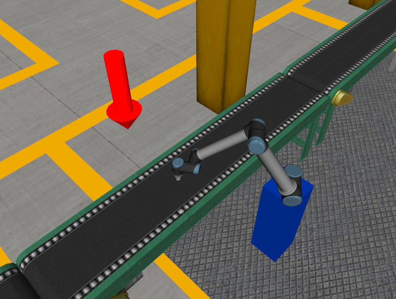
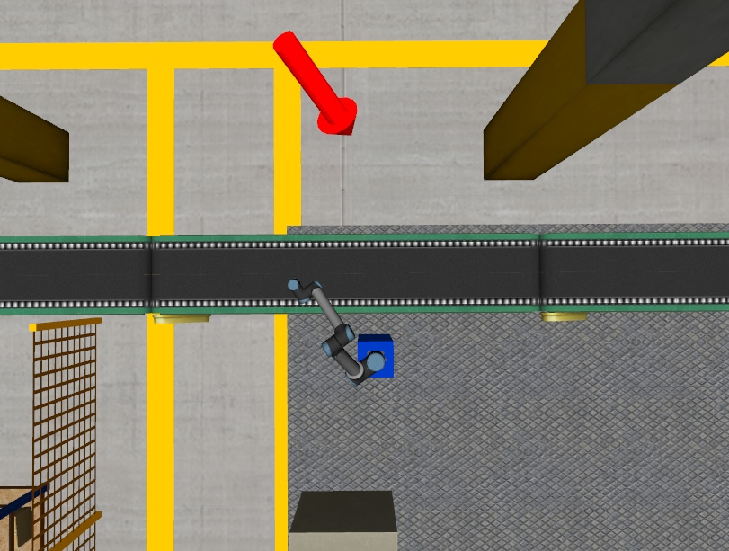
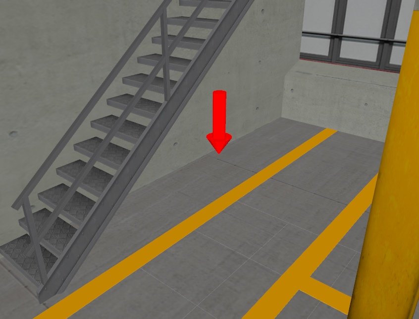
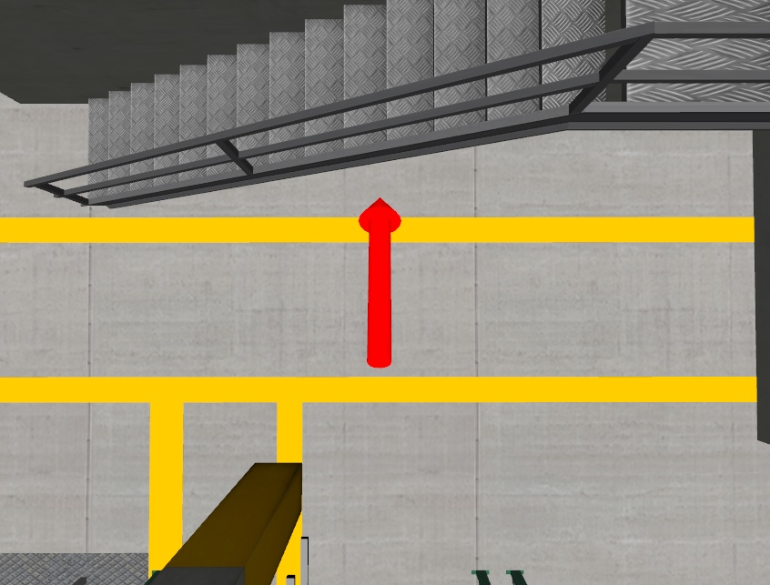
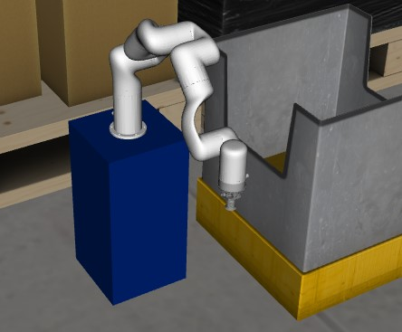
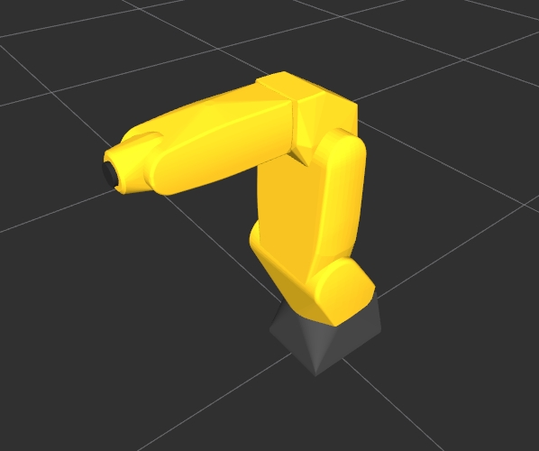

# ROS2 urdf


In deze workshop leer je een aantal technieken om zelf realistische simulatie omgeving te bouwen.

## Opdracht 1
Plaats een bin(bak) op de hieronder aangegeven plaats.

::::{grid} 2
:::{grid-item-card} 

:::
:::{grid-item-card}

:::
::::


Bewerk daartoe het *"assignment1.urdf.xacro"* bestand in de package urdf_basics van 2_urdf directory.
Voeg je urdf-xml code toe achter de regel:

```
<!-- Add your solution to assignment 1 here -->
```
Tip: Maak eerst door een <xacro>(zie regel 28 als voorbeeld) tag een bin_2_ aan en vervolgens met een <joint> een verbinding met de world_interface. Je kunt bin_1 gebruiken als voorbeeld.

Start assignment 1
```bash
ros2 launch urdf_basics visualize_assignment1.launch.py
```

## Opdracht 2
In deze opdracht ga je een nieuw object toevoegen aan de fabriek: een groene bol.

De bol moet aan de andere kant van de transportband worden geplaatst, onder de trap aan het uiteinde van de fabriek.

Raadpleeg de volgende illustraties. De rode pijl geeft aan waar je de bol moet plaatsen.
::::{grid} 2
:::{grid-item-card} 

:::
:::{grid-item-card}

:::
::::


Bewerk daartoe het *"assignment2.urdf.xacro"* bestand in de package urdf_basics van 2_urdf directory.
Voeg je urdf-xml code toe achter de regel:
```
<!-- Add your solution to assignment 2 here -->
```

Start assignment 2
```bash
ros2 launch urdf_basics visualize_assignment2.launch.py
```
## Opdracht 3
In deze opdracht dien je Robot 2 (de *uFactory xArm6*) te vervangen door een *Fanuc LR Mate 200iC* robot.

Website: [Fanuc LR Mate-serie](https://www.fanuc.eu/be/nl/robots/robot-filter-pagina/lrmate-serie)

In de onderstaande figuren staat de (al geplaatste) *uFactory xArm6* robot aan de linkerkant. Daaronder staat de nieuwe robot, de *Fanuc LR Mate 200iC* (let op: dit toont alleen de robot, het is geen voorbeeld van de oplossing).

::::{grid} 2
:::{grid-item-card} 

:::
:::{grid-item-card}

:::
::::


Bewerk daartoe het *"assignment3.urdf.xacro"* bestand in de package urdf_basics van 2_urdf directory.

Het xacro bestand van de *Fanuc LR Mate 200iC* robot bevindt zich in de volgende plaats:
* Package: fanuc_robots
* Directory: urdf
* Bestandsnaam: lrmate200ic.urdf.xacro

Voeg je urdf-xml code toe achter de regel:
```
<!-- Update the below block for assignment 3 here -->
```

Start assignment 3
```bash
ros2 launch urdf_basics visualize_assignment3.launch.py
```


## Opdracht 4
In deze opdracht leer je een fout in een urdf- of xacro-bestand te zoeken en op te lossen.

Start assignment 4
```bash
ros2 launch urdf_basics visualize_assignment4.launch.py
```
Je zult zien dat er een foutmelding optreed. Je kunt de oorzaak van de fout op sporen door de volgende twee stappen:
* xacro-bestand omzetten naar een urdf-bestand
    * Let op: Dit hoeft niet te gebeuren als je al een urdf-bestand hebt.
* Met het commando "check_urdf" een controlle op het urdf-bestand uitvoeren

Zorg dat je in de juiste directory bent:
``` bash
cd ~/ros2_industrial_ws/src/ROS2_industrial/2_urdf/urdf_basics/urdf
```

Met onderstaand commado kun je een .xacro bestand omzetten naar een .urdf bestand en vervolgens controleren op fouten.
``` bash
xacro assignment4.urdf.xacro > assignment4.urdf
```

Controlleer het urdf-bestand op fouten met het commando:
``` bash
check_urdf assignment4.urdf
```
De foutmelding die je krijgt, geeft een aanwijzing over de oorzaak van de fout. Zoek de fout in het *"assignment4.urdf.xacro"* bestand en los deze op.

Let op: Het gegenereerde urdf-bestand hoeft niet aangepast te worden, alleen het xacro-bestand.

