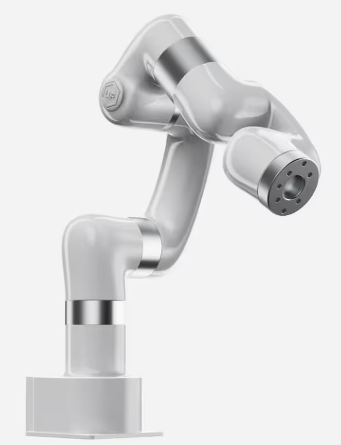

# Practicum Manipulatie

In dit practicum gaan we aan de slag met manipulatie in ROS2. We zullen een `uFactory Lite6` robotarm installeren en leren hoe we deze kunnen aansturen met ROS2.

De `uFactory Lite6` is een compacte robotarm die geschikt is voor educatieve doeleinden en lichte industriële toepassingen. Deze robotarm heeft 6 vrijheidsgraden, wat betekent dat hij in staat is om complexe bewegingen uit te voeren. In dit practicum zullen we de robotarm installeren, configureren en aansturen met ROS2.

Deze robot zul je ook gebruiken bij de opdrachten in het vervolg van de module AI-Driven Robotics.

## Opdracht 1: Installeren van de robotarm
Volg de  instructies beschreven in [uFactory Template Repository](https://avansmechatronica.github.io/my_ufactory_ROS2/) om de robotarm te installeren en te configureren. Zorg ervoor dat je alle stappen zorgvuldig volgt, zodat de robotarm correct is geïnstalleerd en klaar is voor gebruik.

:::{note}
Gebruik voor onderstaande opdrachten alleen de packages die beginnen met "my_uf". Deze zijn specifiek voor deze workshop en bevatten de benodigde configuraties en code om de robot aan te sturen.
:::

## Opdracht 2: Toevoegen van een robot pose
Voeg met de MoveIt setup assistant een pose toe aan de robot. Deze pose kan bijvoorbeeld een specifieke positie zijn die de robotarm moet bereiken. Gebruik de MoveIt setup assistant om deze pose te definiëren en op te slaan in de configuratie van de robot. Test vervolgens of je deze pose kunt bereiken met de robotarm door een plan te maken en uit te voeren in Rviz.

## Opdracht 3: Aansturen van de robotarm met Python`
Bestudeer het Python programma in de `my_uf_demo` package. Dit programma bevat een voorbeeld van hoe je de robotarm kunt aansturen met Python. Pas dit programma aan zodat het de robotarm naar de pose beweegt die je in opdracht 2 hebt toegevoegd. Zorg ervoor dat je de juiste ROS2 commando's gebruikt om de robotarm te bewegen en test je programma om te zien of het werkt.

## Opdracht 4: Toevoegen van een object in de omgeving
Voeg een object toe aan de omgeving van de robotarm. Dit kun je doen door een object in RVIZ te plaatsen. Maak vervolgens een plan om de robotarm naar een positie te bewegen die dicht bij het object is, zonder het object te raken. Test je plan in RVIZ en zorg ervoor dat de robotarm veilig beweegt zonder het object te raken.
Sla de RVIZ-configuratie op.

## Opdracht 5: Python beweging met vermijding van het object
Pas het Python programma aan zodat de robotarm een beweging maakt naar een doelpositie, terwijl het object in de omgeving wordt vermeden. Gebruik de MoveIt planning functionaliteit om een pad te plannen dat het object ontwijkt. Test je aangepaste programma om te zien of de robotarm succesvol naar de doelpositie beweegt zonder het object te raken.

:::{tip}
Maak 2 poses in translation en quaternion formaat die je hebt gebruikt in deze opdracht. Gebruik deze poses om de robot te bewegen om het object heen.
:::